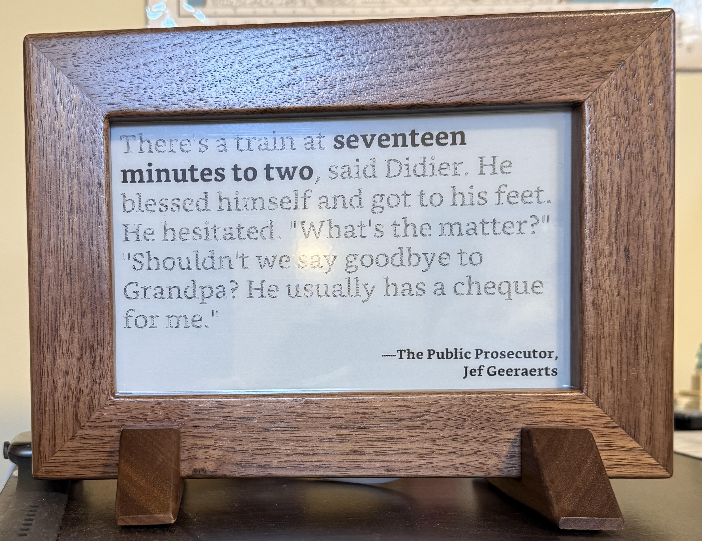
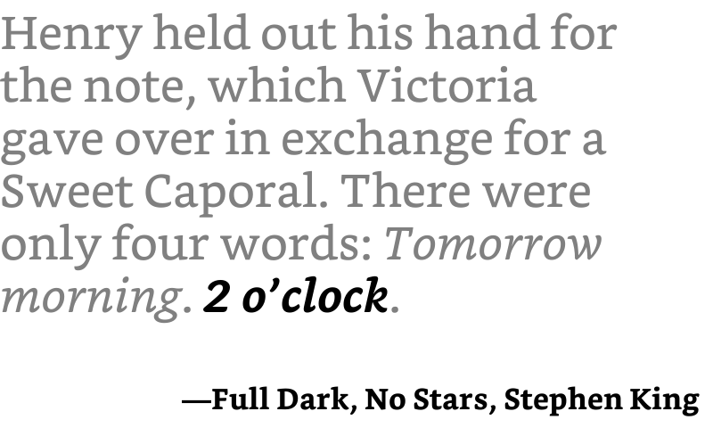
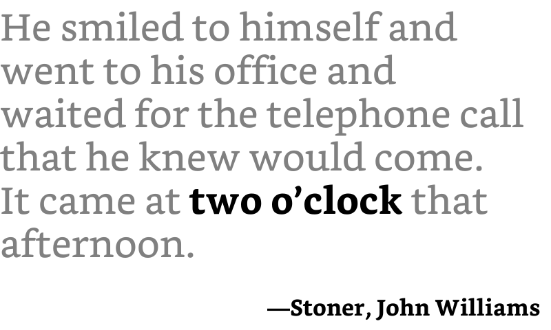
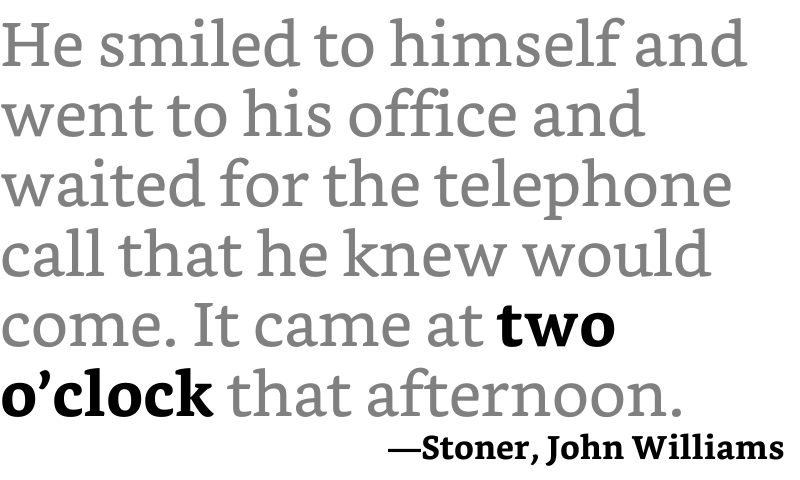

# Literary Quote Clock

I made a clock that displays the time using quotes from various books using a [Raspberry Pi Zero 2WH](https://www.raspberryPi.com/products/raspberry-Pi-zero-2-w/) and Waveshare's [7.5 inch E-ink display](https://www.waveshare.com/7.5inch-e-paper-hat.htm). (Almost) every minute of the day has at least one corresponding quote, but many have multiple possible quotes that may be used (one is chosen at random).

<p align="center">
    
</p>

## Materials:

- [Waveshare 7.5 inch E-ink Display & HAT](https://www.waveshare.com/7.5inch-e-paper-hat.htm)

- [Raspberry Pi Zero 2WH](https://www.raspberryPi.com/products/raspberry-Pi-zero-2-w/)
  - _Note:_ Waveshare sells a [pre-soldered Pi](https://www.waveshare.com/product/raspberry-Pi/boards-kits/raspberry-Pi-zero-2-w-cat/raspberry-Pi-zero-2-w.htm?sku=21039), which is what I used

## Setting the Pi Up

1. Waveshare has provided a handy guide for configuring a Pi to use their screen. The guide can be accessed [here](https://www.waveshare.com/wiki/7.5inch_e-Paper_HAT_Manual). The [Working With Raspberry Pi](https://www.waveshare.com/wiki/7.5inch_e-Paper_HAT_Manual#Working_With_Raspberry_Pi) section pertains to this specific project.

2. After you have verified that the screen is working via Waveshare's demo, clone this repository to the Pi.

3. Initialize a venv with `python3 -m venv venv`, activate it with `source venv/bin/activate`, then install necessary packages with `pip install -r requirements.txt`.

4. In the [`clock.service`](\clock.service) script, modify the `WorkingDirectory` variable to store the path to the cloned repo and the `ExecStart` variable to store the path to `clock.py` in the cloned repo. Then, move the [`clock.service`](\clock.service) file into `/etc/systemd/system`.

5. Run `sudo systemctl restart clock.service` to start the clock. The script will now automatically start the clock any time that the Pi is turned on.

6. (Optional) It seems that an unstable WiFi connection can cause the clock to desync with the actual time, meaning quotes don't change at the correct moment. A workaround to the issue is to add a crontab that reboots the Pi everyday at 4AM. This doesn't always fix the problem, and sometimes I have to unplug the Pi from its power source which usually does the trick for some reason. You can add this cronjob by running:

   ```sh
   sudo crontab -e
   ```

   Then

   ```sh
   0 4 * * * /sbin/shutdown -r now
   ```

### Other

- To view the top (start) of the clock's logs: `journalctl -u clock.service`

- To view the clock's most recent logs: `journalctl -e -u clock.service`

## How the Clock Works

All of the clock's logic lies in `clock.py`. There are three stages that the clock runs in: the initialization stage, the display & update stage, and the in-between stage.

### The Initialization Stage

This stage occurs only once when the clock is plugged in. This project was a gift to my girlfriend for her birthday, so I wanted it to be as plug-and-place as possible. To achieve this, I created a simple systemd unit configuration file ([`clock.service`](/clock.service)) that runs once the Pi has an internet connection, and starts the clock by running the [`clock.py`](/clock.py) file. It still takes about 30 seconds for the Pi's internal clock to be updated from this point, so the clock performs a full initialization on the screen to remove any ghosted Pixels and displays this startup image in the meantime:

<p align="center">

</p>

After 30 seconds, the `get_image()` function is called to display a quote for the current time. Then, the clock's quote buffer is initialized.

- Note: Because it may take a second or two for the program to read, process, and display an image, a list is used as a buffer to store three `Image` objects. The buffer contains images for the next minute's quote, the quote two minutes ahead of the current quote, and the quote three minutes ahead of the current quote.

Example: The clock is started at 12:51:15. The startup image has been displayed for 30 seconds, so the quote for 12:51 is displayed at 12:51:45, and the number of seconds until 12:52 is calculated; the program sleeps for this amount of time minus 1 second (it takes ~1 second for the screen to update, so 14 seconds). Then the buffer, `clock.quote_buffer` is initialized with `Image` objects for 12:52, 12:53, and 12:54.


### The Display & Update Stage

This stage occurs once every minute, and most of the magic happens here. First, we check if `main()` is being called at the 29th or 59th minute of the hour. If it is, perform a full refresh (i.e., every 30 minutes). Then, two things happen. First, we display a new quote, and then we update the quote buffer. At the 59th second of a minute [`display_quote()`](/clock.py#L142) is called, which updates the `curr_image` variable to hold the `Image` obj  stored at `quote_buffer[0]`. Then, [`update_buffer()`](/clock.py#L113) is called, which appends the `Image` obj for the quote that is two minutes ahead of the `Image` obj stored at `quote_buffer[1]` and removes the `Image` obj at `quote_buffer[0]` (the currently displayed quote).

- Note: `Image` objects are generated on the fly with the [`get_image()`](/clock.py#L33) function.

This may be easier to understand with an example. Suppose the current time is 13:31:40, so `curr_image` stores the `Image` obj for 13:31, and `quote_buffer` stores the following: `[1332_Img, 1333_Img, 1334_Img]`. At 13:31:59, [`display_quote()`](/clock.py#L142) is called, which updates `curr_image` with `self.curr_image = self.quote_buffer[0]`, then displays the quote using `self.epd.display(self.epd.getbuffer(self.curr_image))` to display the quote for 13:32. Then, `1335_Img` is appended to the buffer and `1332_Img` is removed, resulting in the buffer looking like this: `[1333_Img, 1334_Img, 1335_Img]`.

### The In-Between Stage

This stage involves everything that happens in the time between a quote being displayed and waiting for the end of the current minute. First, the screen is put to sleep to reduce its power consumption, then we calculate how long until the next minute so that we know when to wake screen and re-enter the Display & Update Stage. The cycle between the Display & Update Stage and the In-Between Stage continues as long as the clock runs.

## Credits

Both [`get_image.py`](./get_image.py) and [`make_images.py`](./misc/make_images.py) are modified versions of elegantalchemist's [`quote_to_image.py`](https://github.com/elegantalchemist/literaryclock/blob/main/quote%20to%20image/quote_to_image.py) program. [`get_image.py`](./get_image.py) serves as an auxiliary program to generate images on the fly, which are appended to the clock's quote buffer and discarded after they’re displayed. [`make_images.py`](./misc/make_images.py) can be ran independently to generate and save all of the images to an `/images` folder.

Both files generate images by parsing a CSV file and converting each row into a .bmp file. I am using [JohannesNE's CSV file](https://github.com/JohannesNE/literature-clock/blob/master/litclock_annotated.csv) (renamed to `quotes.csv`) instead of [elegantalchemist's](https://github.com/elegantalchemist/literaryclock/blob/main/quote%20to%20image/litclock_annotated_br2.csv). Both contain many of the same quotes but JohannesNE's seems more refined and has more quotes overall.

The biggest modification I made is to the image generation files is to handle italic characters. JohannesNE's CSV file contains a few quotes that have italic characters (their project is a literary quote clock website that uses HTML which makes it a lot easier to handle italic text), and elegantalchemist's code doesn't have a way to detect and handle these characters. With CSS, you can easily change the `font-style` between normal, _italic_, and **bold**, but in my case a different font file is needed for italicized characters because font files can only contain one font style. 

My solution is to wrap italicized words in a `◻` character (white medium square, `U+25FB`) since each quote is written to the .bmp file word-by-word. Quotes that have the time part italicized are wrapped with a `◯` character (large circle, `U+25EF`) since they'll need a font file that has bolded and italicized characters.

For example, part of a quote for 2 A.M. needs to be formatted as: 

>There were only four words: *Tomorrow morning*. ***2 o’clock***.

With my changes, this formatting can be specified in the CSV file with:

>There were only four words: ◻Tomorrow◻ ◻morning◻. ◯2◯ ◯o’clock◯.

This will result in the following image:

<p align="center">
    
</p>

There are also some quotes where additional formatting helps with the readability of the quote. So far, I have added two other formatting options:

'📖' (Open Book Unicode Character, `U+1F4D6`): Equivalent to `\r\n`. For example, the CSV stores:

> He smiled to himself and went to his office and waited for the telephone call that he knew would come. 📖It came at two o’clock that afternoon.

Which will be formatted as 

<p align="center">
    
</p>

Without this formatting, the quote would have been printed as

<p align="center">
    
</p>

This option is rarely useful, but I’ve still added it to some quotes.

'⭐' (White Medium Star, `U+2B50`): Equivalent to `\r\n` x2. For example, the CSV stores:

> A full one hundred meters down the slope, Kazuo Kiriyama didn't look back. Instead, he glanced down at his watch. ⭐The second hand had just made its seventh click past five.

Which will be formatted as

<p align="center">
    
</p>

Without this formatting, the quote would have been printed as

<p align="center">
    
</p>

I also manually went through all ~3500 quotes in the file and am in the process of modifying the CSV for the following reasons:

- I have found that some quotes can be used for both A.M and P.M. but currently aren't.
- I'd like to add more context to some quotes (i.e., a preceding and/or succeeding sentence)
- I am modifying some because I feel that they are too vague (e.g., "Raymond came back with Masson around one-thirty." with "around one-thirty" highlighted for 13:31 will be used for 13:30 with "one-thirty" being highlighted)
  - I'm keeping some instances of this in. For example, a quote such as "just past [time]," "just before [time]," or similar language might be used for either that 1st minute or 59th minute of an hour.
- A certain part of the quote is or isn't highlighted (e.g., for the quote "A man driving a tractor saw her, four hundred yards from her house, six minutes past two in the afternoon." only "six minutes past two" is highlighted when "six minutes past two in the afternoon" should be).
- Other minor changes such as replacing three full stops (...) with a proper ellipsis unicode character (…).


Additionally, I like to read in my free time, and as I find quotes in the books I read, I add them `quotes.csv` (to see only the quotes that I've found, check out [this file](./misc/my-quotes.csv)). So far, I have added quotes from these books:

- Battle Royale, by Koushun Takami
- Stoner, by John Williams
- All Quiet on the Western Front, by Erich Maria Remarque
- In Cold Blood, by Truman Capote
- The Road, by Cormac McCarthy
- Butcher’s Crossing, by John Williams
- The Great Gatsby, by F. Scott Fitzgerald
- 2001: A Space Odyssey, by Arthur C. Clarke
- Before the Coffee Gets Cold, by Toshikazu Kawaguchi
- Dungeon Crawler Carl, by Matt Dinniman

## Other Notes

### Troubleshooting the Pi

- The Raspberry Pi Zero 2W cannot connect to a 5 Ghz WiFi channel; it only works with 2.4 GHz. If you have issues connecting try the following to troubleshoot:

  1. Log into your modem and temporarily disable the 5 GHz channel, allowing the Pi to connect only to the 2.4 GHz channel. After it connects, you can re-enable the 5 GHz channel.
     - _Note: You shouldn't have to do this every time you turn the Pi on. Once it connects to your WiFi on the 2.4 GHz channel for the first time, it should do so automatically every time moving forward._
  2. Rename the 2.4 GHz channel to have a different SSID.
     - E.g. `SSID-Name-2_4GHz`

- If the you take the clock into a new timezone, the Pi's localization settings need to be changed manually. Otherwise the clock won't display the correct time.
  - Maybe there's a way to read Pi's IP address when it connects to WiFi and update the setting if its timezone is different?

### Misc.

- Waveshare has some additional helpful [documentation](https://www.waveshare.com/wiki/E-Paper_APi_Analysis#Python) on other functions and things that can be done on the screen (separate from their config guide above).