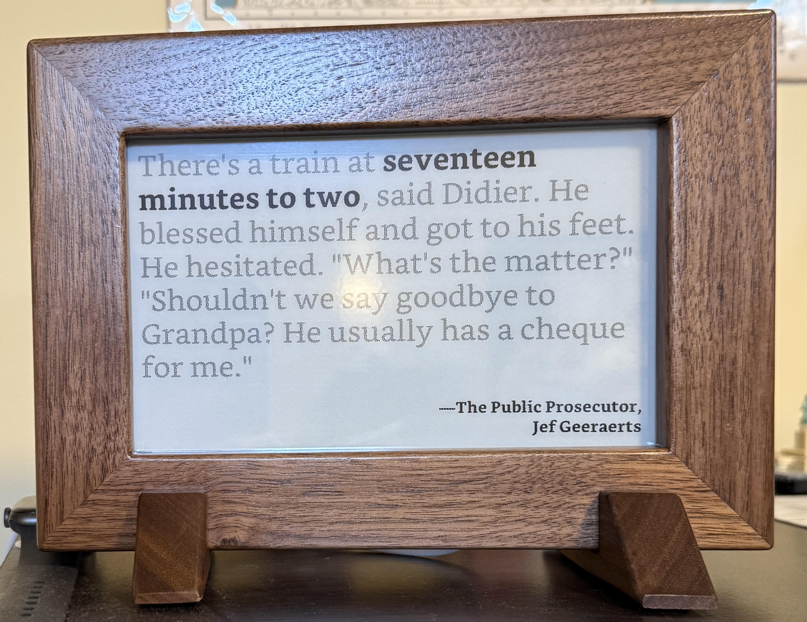
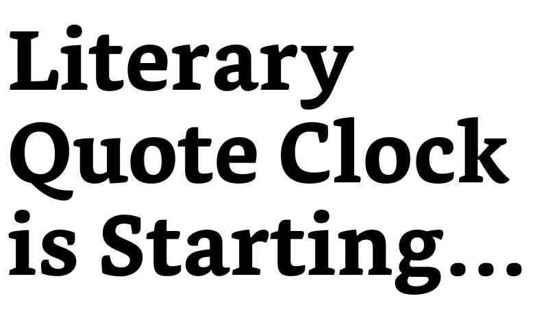
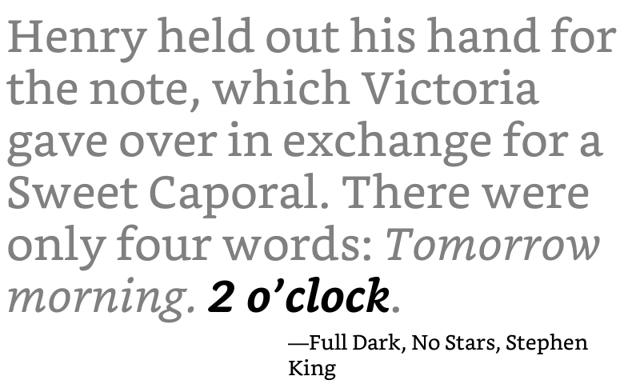
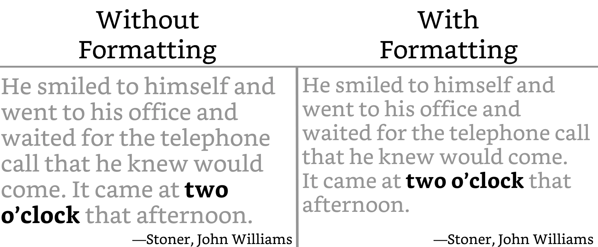
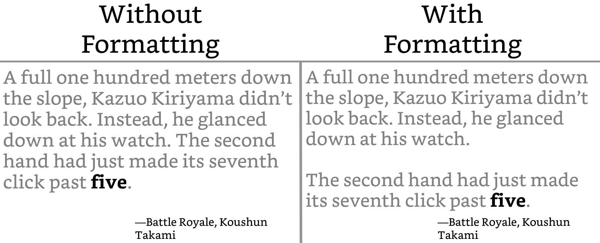

<h1 align="center">Literary Quote Clock</h1>

I made a clock that displays the time using quotes from various books. All 1,440 minutes of the day have at least one corresponding quote, but many have multiple possible quotes that may be used (one is chosen at random).

<p align="center">
    
</p>

There are three ways to make the clock:

1. A [Raspberry Pi Zero 2WH](https://www.raspberryPi.com/products/raspberry-Pi-zero-2-w/) and Waveshare's [7.5-inch E-ink display](https://www.waveshare.com/7.5inch-e-paper-hat.htm) (or any non-IT8951 screen, with minor modification required).

2. A [Raspberry Pi Model 3](https://www.raspberrypi.com/products/raspberry-pi-4-model-b/) and Waveshare's [6-inch E-ink display](https://www.waveshare.com/6inch-hd-e-paper-hat.htm) (or any IT8951 screen, with minor modification required).

3. A jailbroken Kindle.

There are instructions on how to set up the clock for both types of screens below. For instructions on how to install the clock on a jailbroken Kindle, check out the [README](/kindle_clock/README.md) in the */kindle_clock/* folder.

## Table of Contents
<details>
<summary>Click to View</summary>

1. [Materials](#materials)
2. [How to Setup the Clock](#how-to-setup-the-clock)
3. [How the Clock Works](#how-the-clock-works)
4. [Credits](#credits)
5. [Formatting Text](#formatting-text)
6. [Adding, Editing, and Finding Quotes](#adding-editing-and-finding-quotes)
7. [Other Notes](#other-notes)

</details>

## Materials
<!--<h2 align="center">Materials</h2>-->

### Non-IT8951 Screens

- [Waveshare 7.5 inch E-ink Display & HAT](https://www.waveshare.com/7.5inch-e-paper-hat.htm)
- [Raspberry Pi Zero 2WH](https://www.raspberrypi.com/products/raspberry-pi-zero-2-w/)
  - _Note:_ Waveshare sells a [pre-soldered Pi](https://www.waveshare.com/product/raspberry-Pi/boards-kits/raspberry-Pi-zero-2-w-cat/raspberry-Pi-zero-2-w.htm?sku=21039), which is what I used.
- The frame was handmade using walnut wood.

### IT8951 Screens
- [Waveshare 6-inch E-ink Display & HAT](https://www.waveshare.com/6inch-hd-e-paper-hat.htm)
- [Raspberry Pi Model 3](https://www.raspberrypi.com/products/raspberry-pi-4-model-b/)
    - _Note:_ Any Model Pi should work, as long as the hat fits. Check Waveshare's documentation first.
- The frame is currently a WIP.

## How to Setup the Clock
<!--<h2 align="center">How to Setup the Clock</h2>-->

The Pi running the clock uses a headless version of the Raspberry Pi OS.

- _Note:_ Any Unix-like OS should work, but I haven't tried anything else personally. You may need to place the startup script in a different location, and the process of making a crontab may be a bit different.

Prior to following the instructions below, make sure you have completed a basic setup of your Pi. At a minimum, make sure you've configured your timezone, have connected the Pi to a WiFi network, and have some version of Python3 installed. I also recommend configuring SSH to make your life easier.

The next steps are dependent on the type of screen you have. For this documentation, I'll focus on setting up the 7.5" and 6" screens, but these instructions should be easy to adapt for other screens too; just make sure you follow the right one. The library for each of these screens uses the same functions, so you just need to follow the instructions that are specific to your screen.


### IT8951 Screens 

For these type of screens, Greg Meyer's [IT8951](https://github.com/GregDMeyer/IT8951/tree/master) Python library will be used. It is the library that Waveshare recommends.

1. Follow steps 1, 2, and 4 in the [Working with Raspberry Pi (SPI)](https://www.waveshare.com/wiki/6inch_HD_e-Paper_HAT#Working_with_Raspberry_Pi_.28SPI.29) section of Waveshare's wiki. That is, make sure that the screen is properly connected to the Pi, the DIP switch is set to SPI mode, and that the SPI interface is enabled in the Pi's settings.

2. There are a couple of packages that need to be installed for the IT8951 library to work. Run the following:

    ```sh
    sudo apt install build-essential python3-dev python3-tk
    ```

    - `build-essential` is a bundle of C compiler tools.
    - `python3-dev` installs Cythonic stuff for the driver
    - `python3-tk` installs tkinter for the driver. The IT8951 library includes a dev mode where you can print things onto your desktop via tkinter rather than onto the e-paper screen.

3. Clone this repository recursively to the Pi (this will download this repository and the IT9851 library) with:

    ```sh
    git clone --recursive https://github.com/alextaschuk/Literary-Quote-Clock.git
    ```

    - _Note:_ If you forgot the `--recursive` flag, run `git submodule update --init` to clone the IT8951 library locally.

4. Configure a virtual environment within the cloned repo.

    First, `cd` into the cloned repo and initialize a venv:

    ```sh
    python3 -m venv venv
    ```
    
    Then, activate the venv:
    ```sh
    source venv/bin/activate
    ```
    
    Lastly, install the clock's necessary packages:
    
    ```sh
    pip install -r requirements.txt
    ```

5. Install the IT8951 library by running:

    ```sh
    pip install ./[rpi]
    ```

6. (Optional) You can test that everything was installed properly:

    1. Start an interactive interpreter for Python:
    
        ```sh
        python
        ```

    2. Try importing something from the library:

        ```sh
        from IT8951.display import AutoEPDDisplay
        ```

    3. If no errors are thrown, everything was installed correctly. Exit the interpreter:

        ```sh
        exit()
        ```

7. The [constants.py](/constants.py) file is set up for non-IT8951 screens by default, so there are a few modifications that will need to be made:

    1. Change the `SCREEN_WIDTH` and `SCREEN_HEIGHT`, if necessary.

    2. Change the `SCREEN_TYPE` to `ScreenOptions.WAVESHARE`.

    3. Change the `IMAGE_FORMAT` to `'png'`.

    4. Depending on the screen's resolution, you may need to increase `MAX_FONT_SIZE`.

8. In the [clock.service](/scripts/clock.service) script, modify the `WorkingDirectory` variable to store the path to the cloned repo and the `ExecStart` variable to store the path to `clock.py` in the cloned repo. Then, move [clock.service](/scripts/clock.service) into `/etc/systemd/system`.

    - For example, if the repo was cloned into the `Desktop/` directory, change the `WorkingDirectory` variable to `WorkingDirectory=/home/[username]/Literary-Quote-Clock`. Similarly, change `ExecStart` to `ExecStart=/home/[username]/Literary-Quote-Clock/venv/bin/python3 /home/[username]/Literary-Quote-Clock/clock.py`.

9. Start the clock with:

    ```sh
    sudo systemctl enable --now clock.service
    ```

***

### Non-IT8951 Screens 

1. Waveshare has provided a handy guide for configuring a Pi to use their screen. The guide can be accessed [here](https://www.waveshare.com/wiki/7.5inch_e-Paper_HAT_Manual). The [Working With Raspberry Pi](https://www.waveshare.com/wiki/7.5inch_e-Paper_HAT_Manual#Working_With_Raspberry_Pi) section pertains to this specific project.

2. After you have verified that the screen is working via Waveshare's demo, clone this repository to the Pi with:

    ```sh
    git clone https://github.com/alextaschuk/Literary-Quote-Clock.git
    ```

    - _Note:_ Don't include the `--recursive` flag! This is only necessary for IT8951 screens.

3. Configure a virtual environment within the cloned repo.

    First, `cd` into the cloned repo and initialize a venv:

    ```sh
    python3 -m venv venv
    ```
    
    Then, activate the venv:
    ```sh
    source venv/bin/activate
    ```
    
    Lastly, install the clock's necessary packages:
    
    ```sh
    pip install -r requirements.txt
    ```

4. The [constants.py](/constants.py) file is set up for non-IT8951 screens by default, but there may be some modifications that will need to be made:

    1. Change the `SCREEN_WIDTH` and `SCREEN_HEIGHT`, if necessary.

    2. Depending on the screen's resolution, you may need to increase `MAX_FONT_SIZE`.

5. In the [clock.service](/scripts/clock.service) script, modify the `WorkingDirectory` variable to store the path to the cloned repo and the `ExecStart` variable to store the path to `clock.py` in the cloned repo. Then, move [clock.service](/scripts/clock.service) into `/etc/systemd/system`.

    - For example, if the repo was cloned into a `Desktop/` directory, change the `WorkingDirectory` variable to `WorkingDirectory=/home/[username]/Desktop/Literary-Quote-Clock`. Similarly, change `ExecStart` to `ExecStart=/home/[username]/Desktop/Literary-Quote-Clock/venv/bin/python3 /home/[username]/Desktop/Literary-Quote-Clock/clock.py`.

6. Start the clock with:

    ```sh
    sudo systemctl enable --now clock.service
    ```


### Aditional Setup

This is an optional step to help with desync issues and automatically update the clock. I've come across a problem where the clock becomes desync'd with the actual time due to an unstable WiFi connection, meaning quotes don't change at the correct moment. A workaround to the issue is to add a crontab that reboots the Pi every day at 4 AM. This doesn't always fix the problem, and sometimes the Pi has to be unplugged from its power source, which usually does the trick for some reason. The script will pull changes from the clock's remote repository first, so any updates I make (e.g., adding new quotes) will be automatically downloaded. To can add this cron job, run:

   ```sh
   sudo crontab -e
   ```

   Then, add the following in the file that opens:

   ```sh
   0 4 * * * bash /path/to/Literary-Quote-Clock/scripts/update_clock.sh
   ```

   - Don't forget to modify the path!

### Other Commands
<!--<h3>Other Commands</h3>-->

- To generate the quote images and save them to a `/images` directory:

    ```bash
    python3 image_generator.py
    ```

- To view the top (start) of the clock's logs:
    ```bash
    journalctl -u clock.service
    ```

- To view the clock's most recent logs: 
    ```bash
    journalctl -e -u clock.service
    ```

## How the Clock Works
<!--<h2 align="center">How the Clock Works</h2>-->

<p align="center">

</p>

This project was a gift, so I wanted it to be as plug-and-play as possible. To achieve this, I created a simple systemd unit configuration file ([clock.service](/clock.service)) that starts the clock by running the [clock.py](/clock.py) file after the Pi connects to a WiFi network. It still takes about half a minute for the Pi's internal clock to be updated from this point, so the clock performs a full initialization on the screen to remove any ghosted Pixels and displays a startup image in the meantime, then goes to sleep for 30 seconds.

All of the clock's logic lies in [clock.py](./clock.py), and all of the quotes are stored in [quotes.csv](./quotes.csv). The clock runs in a continuous loop that calls the `main()` function once every minute. The clock maintains a buffer that contains three images, each a succeeding minute past the current minute of the hour. At the top of a minute—technically, the 59th second of the previous minute; you'll see what I mean—`display_quote()` is called, and the image at the front of the buffer is displayed to the screen. Then, `refresh_buffer()` is called, which removes the quote that was just displayed from the buffer, and appends a new image for the time that is three minutes ahead of the next image to be displayed.

Here's an example: Suppose that the clock's program is started at 13:31:15. After sleeping for 30 seconds (it is now 13:31:45), the first image to be displayed is generated outside of the `main()` function and is appened to the buffer (this is necessary because of how the buffer works). Then, the `main()` function is called. Inside of `main()`, `display_quote()` is called, to display the image for 13:31. Then, `refresh_buffer()` is called. Inside of this function, the image for 13:31 is removed from the buffer, and the buffer is populated with images for 13:32, 13:33, and 13:34. Assuming this whole process took 1 second, the time is now 13:31:46, so the program goes to sleep for 13 seconds.

- If you're wondering why it slept for 13 seconds instead of 14 (since 60-46 = 14), this is because it takes ~1 second for the image shown on the screen to change, so the program wakes up at the 59th second of the minute instead of the 0th second of the next minute. This makes it look like the change is actually occuring at the 0th second of the next minute instead of the 1st second.

The program wakes up at 13:31:59, and calls `display_quote()` to show the quote for 13:32 on the screen. Then, `refresh_buffer()` is called, which removes the image for 13:32 from the buffer and appends an image for 13:35. The program then sleeps until 13:32:59.

## Credits
<!--<h2 align="center">Credits</h2>-->

I used [JohannesNE's CSV file](https://github.com/JohannesNE/literature-clock/blob/master/litclock_annotated.csv) as a starting point for gathering quotes, and have since made several modifications to the quotes in the file (see [Adding, Editing, and Finding Quotes](#adding-editing-and-finding-quotes)).

Images are generated by parsing the CSV file and writing each row to a .bmp file. I originally used a self-modified version of elegantalchemist's [quote_to_image.py](https://github.com/elegantalchemist/literaryclock/blob/main/quote%20to%20image/quote_to_image.py) program to generate images of the quotes. The biggest modification I made to the image generation files is that it could handle italic and bold characters. However, I wasn't very happy with how readable or maintainable the code turned out to be and I felt that there was a lot of refactoring to be done to the program. I opted to rewrite the entire thing, allowing for any future formatting additions or modifications to be easily added later down the line. The logic for converting a row from the CSV file into an image now exists in [image_generator.py](/image_generator.py) and [writer.py](/writer.py).


## Formatting Text
<!--<h2 align="center">Formatting Text</h2>-->

### Character Formatting

JohannesNE's CSV file contains a few quotes that have italic characters, and their project is a website, so the formatting of text in a quote could easily be changed using the CSS `font-style` property to specify if the text should be normal or _italic_, and the `font-weight` property to specify how thick the text should be to make it **bold** (you can even combine them for text that is _**italicized and bolded**_).

In my case, each style of a font needs its own font file. Since each quote is parsed and drawn on a .bmp image character-by-character, my solution to formatting text is similar to how it is done in markdown where a substring of text can be wrapped with custom character delimiters to specify when different font styles should be applied.

#### Italic '`◻`' (White Medium Square, `U+25FB`) 

Wrap a substring with this character to *italicize* it.

For example, the CSV stores:

> Henry held out his hand for the note, which Victoria gave over in exchange for a Sweet Caporal. There were only four words: ◻Tomorrow morning. 2 o’clock◻.

Which will be formatted as:

<p align="center">
    
</p>

#### Bold: '`◯`' (Large Circle, `U+25EF`)

Wrap a substring with this character to **bold it**.

There aren't any quotes yet where the bold delimiter has been needed, but I have added it as an option just in case.

---

### Word Formatting

There are some instances where preserving a quote's original formatting can help to improve the readability of the quote. They're rarely useful as there is limited screen space to work with, but I have added them anyway.

#### Newline: '`␤`' (Symbol For Newline, `U+2424`)

Add this character to put the succeeding word(s) on a new line (equivalent to `\r\n`). Though this option makes very little difference, I've decided to keep it just in case.

For example, the CSV stores:

> He smiled to himself and went to his office and waited for the telephone call that he knew would come. ␤It came at two o’clock that afternoon.

<p align="center">
    
</p>

---

#### Double Newline '`⇇`' (Leftwards Paired Arrows, `U+21C7`)

Add this character to put a blank line between wrapped text and the next word (equivalent to `\r\n\r\n`).

For example, the CSV stores:

> A full one hundred meters down the slope, Kazuo Kiriyama didn't look back. Instead, he glanced down at his watch. ⇇The second hand had just made its seventh click past five.

<p align="center">
    
</p>


## Adding, Editing, and Finding Quotes
<!--<h2 align="center">Adding, Editing, and Finding Quotes</h2>-->

I have manually read through all ~3500 quotes in the original CSV and am in the process of modifying ~700 of them. I have a somewhat strict list of qualities that the quotes can and cannot have, and specific types of changes that I make depending on what I think is "wrong" about the quote's context, formatting, etc. This section covers some of the things that I look for when evaluating if a quote needs to be modified or removed, my own quotes that I have found and added, and a list of minutes that are missing quotes/are in need of better quotes.

---

**Can the quote be used for both the A.M. and P.M. times of the day (e.g., 07:00 and 19:00)?**
    
- If the answer is "yes", check if the quote has already been used twice. If not, add it to the other time.

- If the answer is "no", check that the quote wasn't mistakenly added to both times of the day. If it was, remove it from the second time.

Example 1:
> At **8 o’clock** on Thursday morning Arthur didn't feel very good. —_The Hitchhiker’s Guide to the Galaxy_, Douglas Adams
  
Clearly, this quote should only be used for 08:00. Check if there is also a row for the quote at 20:00. If there is, remove it.

Example 2:
> The front doorbell rang at **one minute to ten**, and Karl answered it. —_Best Kept Secret_, Jeffrey Archer

This quote is vague enough that it is not clear whether "__one minute to ten__" is referring to 9:59 or 21:59 (unless you have read the book, which I haven't). Check if there is a row for the quote at 21:59. If there isn't, add it.

---

**Does the quote mention more than one time of the day?**

If it does, check if the additional time(s) also have this quote. Otherwise, add them as new rows.
  
Example:

> My watch lay on the dressing-table close by; glancing at it, I saw that the time was **twenty-five minutes to seven**. I had been told that the family breakfasted at nine, so I had nearly two-and-a-half hours of leisure. Of course, I would go out, and enjoy the freshness of the morning. —_Ravensdene Court_, J.S. Fletcher

This quote was used for 06:35, but it can also be used for 09:00. However,it didn't have a row for 09:00 (it can technically be used for 07:00 too, though I chose not to add it for this time because "**seven**" is being used to refer to a number of minutes before 07:00). Furthermore, it is clear from the context of the quote that the time of day is morning, so the quote should only be added for 9:00 and not 21:00 too. Using the quote for 09:00, it would look like this:

> My watch lay on the dressing-table close by; glancing at it, I saw that the time was twenty-five minutes to seven. I had been told that the family breakfasted at **nine**, so I had nearly two-and-a-half hours of leisure. Of course, I would go out, and enjoy the freshness of the morning. —_Ravensdene Court_, J.S. Fletcher

---
  
**Does the quote require more or less context (i.e., a preceding and/or succeeding sentence)? Could the quote be enhanced by adding more context?**

If more context is required or could possibly enhance the quote,  add it as needed.

Example 1:
> There were only four words: _Tomorrow morning. 2 o’clock_. —_Full Dark, No Stars_, Stephen King

The context of this sentence is not clear to the reader by itself. The four words could be words that someone spoke, wrote, or read. However, when we add the preceding sentence, the context becomes significantly more obvious: 

> Henry held out his hand for the note, which Victoria gave over in exchange for a Sweet Caporal. There were only four words: _Tomorrow morning. 2 o’clock_.

Now, it is clear to the reader that the four words were written on a note that a character named Victoria traded to someone named Henry for a pack of Sweet Caporals.

Example 2:

> It was nine o’clock when we finished breakfast and went out on the porch. —_The Great Gatsby_, F. Scott Fitzgerald

By itself, this quote is perfectly fine and makes sense. However, we can include the sentence that follows to provide a bit more information to the reader:

> It was nine o’clock when we finished breakfast and went out on the porch. The night had made a sharp difference in the weather, and there was an autumn flavor in the air. —The Great Gatsby, F. Scott Fitzgerald

---

**Does the quote specify an exact hour and minute?**

The strictness of this rule is dependent on a quote-to-quote basis and the wording that is used. If the mention of time in a quote is worded with "just past [**time**]," "just before [**time**]," or similar language, I will usually use the quote the 1st minute or the 59th minute of an hour.

Example 1:

> Raymond came back with Masson around one-thirty. His arm was bandaged up and he had an adhesive plaster on the corner of his mouth. The doctor had told him it was nothing, but Raymond looked pretty grim. Masson tried to make him laugh. But he still wouldn't say anything. —_The Stranger_, Albert Camus

Prior to modification, this quote was being used for 13:31, with the time quote being "Raymond came back with Masson **around one-thirty**." My issue with this is that "around" leaves too much room for interpretation and doesn't tell the reader what time it actually is. I moved it to be displayed at 13:30 and change the time quote to instead be "Raymond came back with Masson around **one-thirty**."

Example 2:

> Shuya held his watch up to the moonlight. The finely crafted old model K. Hattori diver’s watch (a gift, like most of his possessions, with him living in an orphanage) read **just past 2:40**. Whatever had happened to Yoshio Akamatsu, nearly all of the students would have left the school by now, save for two or three. —_Battle Royale_, Koushun Takami

- I would use this quote for 02:41, but it would be perfectly fine to use it for 02:40 instead (though, I wouldn't use it for both since that could cause the same quote to be displayed back-to-back).

---

There are also general formatting changes that I look for and apply as needed. This includes things such as fixes when a certain part of the quote that should/shouldn't be highlighted is or isn't:

> A man driving a tractor saw her, four hundred yards from her house, **six minutes past two** in the afternoon. —_A Change of Climate_, Hilary Mantel

This sentence should have "in the afternoon" as a part of the time quote because it specifies that the time is 14:06 and not 02:06.

> A man driving a tractor saw her, four hundred yards from her house, **six minutes past two in the afternoon**. —_A Change of Climate_, Hilary Mantel

Minor changes to character formatting, including:
- Replacing instances of three full stops (`...`) with a proper horizontal ellipsis character (`…`, `U+2026`)
- Replacing instances of two hyphens (`--`) with an em dash (`—`)
- Replacing all instances of double quotation marks (`"`) with a left double quotation mark (`“`, `U+201C`) or a right double quotation mark (`”`, `U+201D`) for the opening and closing of quotes.

---

<h3>Adding My Own Quotes</h3>

As I find quotes in the books I read in my free time, I add them to the CSV file (see [my-quotes.csv](./misc/my-quotes.csv) for only the quotes I have found). Here are the books I have found quotes in while reading:

| Title                          | Author               | Number of Quotes      |
| ------------------------------ | -------------------- | ----------------      |
| Battle Royale                  | Koshun Takami        | 59                    |
| Stoner                         | John Williams        | 21                    |
| All Quiet on the Western Front | Erich Maria Remarque | 20                    |
| In Cold Blood                  | Truman Capote        | 84                    |
| The Road                       | Cormac McCarthy      | 8                     |
| Butcher’s Crossing             | John Williams        | 16                    |
| The Great Gatsby               | F. Scott Fitzgerald  | 51                    |
| 2001: A Space Odyssey          | Arthur C. Clarke     | 10                    |
| Before the Coffee Gets Cold    | Toshikazu Kawaguchi  | 3                     |
| Dungeon Crawler Carl           | Matt Dinniman        | 5                     |
| Carl’s Doomsday Scenario       | Matt Dinniman        | 2                     |
| Dune                           | Frank Herbert        | 12                    |
| Dune Messiah                   | Frank Herbert        | 3                     |
| Children of Dune               | Frank Herbert        | 16                    |
| God Emperor of Dune            | Frank Herbert        | 1 (Currently Reading) |

- *Note*: A few of these quotes are used for AM and PM, so the third column is for total quotes found in each book, not unique quotes.

---

<h3>Times In Need of a Better Quote</h3>

There are some minutes of the day that only have one quote as an option that I'd like to remove, but can't since it's the only quote for that time. 

Quotes Needing Replacement |
-------------------------  |
00:51                      |
00:57                      |
05:26                      |
06:02                      |
07:36                      |
08:01                      |
08:02                      |
09:08                      |
12:31                      |
17:35                      |
18:04                      |

## Other Notes
<!--<h2 align="center">Other Notes</h2>-->

<h3>Troubleshooting the Pi</h3>

The Raspberry Pi Zero 2W cannot connect to a 5 Ghz WiFi channel; it only works with 2.4 GHz. If you have issues connecting try the following to troubleshoot:

  1. Log into your modem and temporarily disable the 5 GHz channel, allowing the Pi to connect only to the 2.4 GHz channel. After it connects, you can re-enable the 5 GHz channel.
     - _Note: You shouldn't have to do this every time you turn the Pi on. Once it connects to your WiFi on the 2.4 GHz channel for the first time, it should do so automatically every time moving forward._
  2. Rename the 2.4 GHz channel to have a different SSID.
     - E.g. `SSID-Name-2_4GHz`

If the you take the clock into a new timezone, the Pi's localization settings need to be changed manually. Otherwise the clock won't display the correct time.

<h3>Miscellaneous</h3>

Waveshare has some additional helpful [documentation](https://www.waveshare.com/wiki/E-Paper_APi_Analysis#Python) on other functions and things that can be done on the screen (separate from their config guide).
