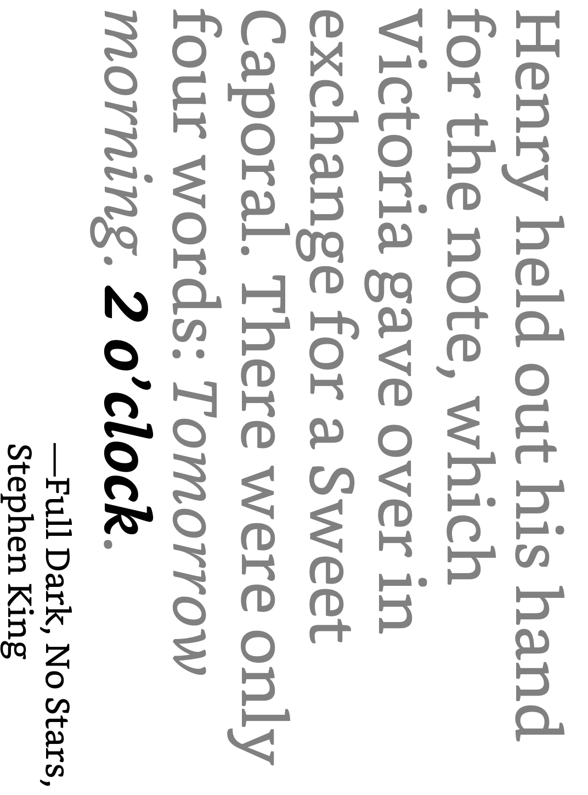
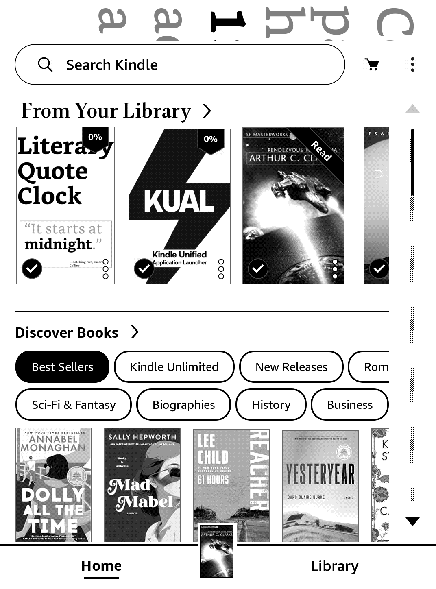

# Literary Quote Clock Kindle Scriptlet

https://kindlemodshelf.me/

## Table of Contents
<details>
<summary>Click to View</summary>

1. [Setting Up and Installing the Extension](#setting-up-and-installing-the-extension)
2. [How to Turn the Clock Off](#how-to-turn-the-clock-off)
3. [Notes About the Script](#notes-about-the-script)

</details>

## Setting Up and Installing the Extension

The setup instructions will be broken into two parts: generating the images for the clock, and jailbreaking the kindle/installing the clock.

Since this repository is set up to work as a clock for Kindles and other e-paper screens, there is a bit of configuration that will need to be done prior to generating the images.

### Image Generation

1. Clone this repository to your local device with:

    ```sh
    git clone https://github.com/alextaschuk/Literary-Quote-Clock.git
    ```
    
    - _Note:_ Don't include the `--recursive` flag! This is only necessary for IT8951 screens.

2. Configure a virtual environment within the cloned repo.

    First, `cd` into the cloned repo and initialize a venv:

    ```sh
    python3 -m venv venv
    ```
    
    Then, activate the venv:
    ```sh
    source venv/bin/activate
    ```
    
    Lastly, install the clock's necessary packages:
    
    ```sh
    pip install -r requirements.txt
    ```

3. The `constants.py` file is set up for non-IT8951 screens by default, but there may be some modifications that will need to be made:

    1. Make sure `SCREEN_WIDTH` and `SCREEN_HEIGHT` match your Kindle's display dimensions. You can check your model's display size at the [Device specifications](https://en.wikipedia.org/wiki/Amazon_Kindle#Device_specifications) section of Wikipedia's article on Kindles.
    2. Change the `IMAGE_FORMAT` to `'png'`.
    3. Depending on the screen's resolution, you may need to increase `MAX_FONT_SIZE`.

4. (Optional) If you want the images to be displayed in landscape mode on the Kindle, make sure you swap the values for `SCREEN_WIDTH` and `SCREEN_HEIGHT`, since they are given in portrait mode on the Wikipedia article. Then, in [image_generator.py](/image_generator.py), uncomment `quote_image = quote_image.transpose(method=Image.Transpose.ROTATE_270)` at the end of the `generate_img()` function. The images need to be physically rotated to display on the screen properly.

    - I haven't tested this on a Kindle that has built-in option to change the screen's orientation, but you shouldn't need to worry about this step if you can change the orientation in the Kindle's settings.

    - TODO: Add a check in the clock's script to check if the Kindle has a screen orientation setting. If it does, when the clock is started save the user's current orientation, then change it to landscape if needed. When the clock is turned off, revert to the original orientation.

        

5. Generate the images by running:

    ```sh
    python image_generator.py
    ```

6. Move the _images/_ folder into */kindle_clock/literary_clock/*.

### Installing the Clock Extension

Next, you need to jailbreak your Kindle. If you have already done this and have KUAL installed, skip to step 5.

Since the type of jailbreak you need varies depending on the type of Kindle you have, follow the [Kindle Modding Wiki’s Guides](https://kindlemodding.org/jailbreaking/index.html). While following the guide, make sure that steps 1-4 are completed.

1. Install a jailbreak (e.g., WinterBreak or AdBreak)

2. Install a hotfix, if needed. This is dependent on your Kindle. Some jailbreaks will do this for you. 

3. Install KUAL (Kindle Unified Application Launcher) and MRPI (MobileRead Package Installer).

4. Disable OTA (Over-the-Air) updates. These can cause the jailbreak to be removed from your Kindle. Similar to the hotfix, you may or may not have to do this, depending on if your jailbreak does it for you or not.

5. If you don't want to set up SSH to transfer the files to your Kindle, plug it into your computer and open the folder that is associated with the device. If you _do_ want to use SSH, install USBNet(Lite) from notemarek's [repository](https://github.com/notmarek/kindle-usbnetlite/tree/master). 
    - Once it is installed, open KUAL and select `USBNetLite`
    - Select `* Toggle USBNetwork *` to enable SSH.
    - Exit out of KUAL and in the Kindle’s search bar, search for `;711`. On this page, you will be able to find your Kindle's IP address. 
    - To SSH into the Kindle, enter `ssh root@[kindle’s IP addr]`. The password is `kindle`.

6. Move the */literary_clock/* folder from the local repository into _/mnt/us/documents_. Then, move the literary_clock.sh file out of the */literary_clock/* folder and into _/mnt/us/documents_. Next time you turn on the Kindle, the clock should show up in your library.

7. (Optional) By default, the clock is set up to have "active hours" from 07:00 until 21:30, during which it prevents the Kindle from going to sleep. During inactive hours (21:31 to 06:59), the Kindle is able to go to sleep, and, if it is supported, the screen will be put into dark mode. This reduces battery consumption at night and makes the screen easier on the eyes. To change the clock's active hours, modify the `START_SLEEP` and `END_SLEEP` variables in [literary_clock.sh](/kindle_clock/literary_clock/literary_clock.sh).
    - _Note:_ The clock will also automatically enable going to sleep if the Kindle's battery drops below 20%.

8. Start the clock by selecting the "Literary Quote Clock" book that shows up in your library.

## How to Turn the Clock Off

1. Swipe down on the screen to open the Quick Settings panel, then exit this panel. From here, you will be able to paritally see the Home screen.

2. Select the Literary Quote Clock thumbnail in your library. This will turn the clock off.

## Notes About the Script

There are a few odd behaviors about the script that I may or may not attempt to fix in the future, since they're very minor.

When the script first starts up, the first image will not display properly because part of the Kindle's Home screen refreshes when it opens a "book". You'll also notice this when the Kindle's battery changes, or when it goes to sleep—it will be drawn over top of the current image shown. This will fix itself when the next minute rolls around.

- A solution to this may be having the clock just sleep for 3-5 seconds before displaying the first image to allow the screen to update first.


